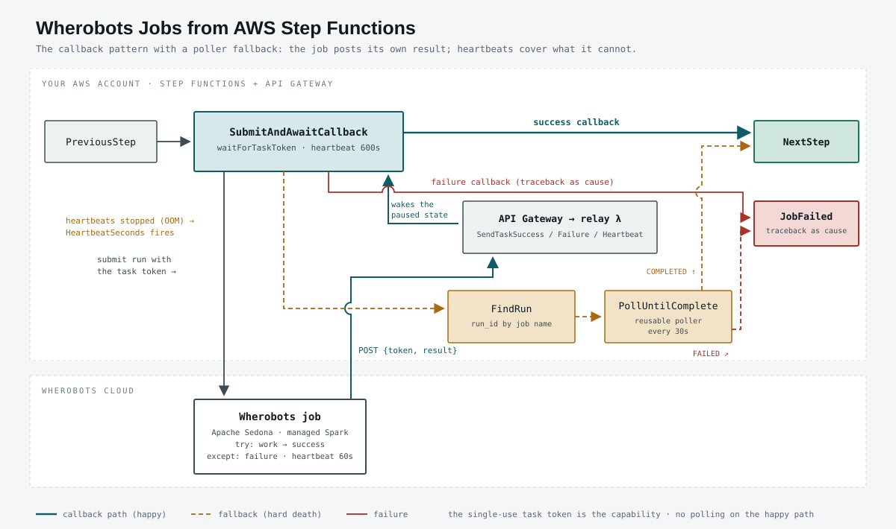
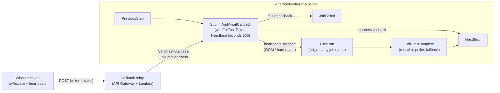

# Wherobots job runs from AWS Step Functions

A minimal reference implementation that submits a [Wherobots](https://wherobots.com)
job run from an AWS Step Functions pipeline using the
[`wherobots-python-sdk`](https://pypi.org/project/wherobots-python-sdk/). The job
reports back via the **callback pattern** (`waitForTaskToken` + heartbeats), with a
**reusable poller state machine** as the fallback for failures the job can't report
itself. Everything can be driven from a guided browser dashboard that shows each
command as it executes.

> Reference / learning tool, not a production build-out: it favors visible,
> plain AWS CLI calls over templates and abstraction.



*(An [8-bit arcade version](assets/flow-8bit.svg) of the same flow exists for less serious venues.)*

## What it shows

- **Step Functions** is AWS's workflow service: a *state machine* moves a JSON
  document through states (Lambda calls, waits, choices). Each execution is
  visible step-by-step in the AWS console.
- **The Wherobots Python SDK** submits and monitors Spark/Sedona job runs with
  just a Wherobots API key — `WherobotsJob(...).submit()` to start,
  `WherobotsJob.from_run_id(...)` to attach to an existing run and check status.
- **The callback pattern** (`waitForTaskToken`): the submit Lambda hands the job a
  task token; the state machine pauses; the job itself POSTs
  success/failure to a relay Lambda behind an API Gateway HTTP API, which calls
  `SendTaskSuccess`/`SendTaskFailure`. No polling on the happy path — the state
  machine wakes the instant the job finishes.
- **Why try/except/finally alone can't make this safe**: a driver OOM or cluster
  kill ends the process mid-instruction — no `except` runs, no `finally` runs, no
  callback is ever sent. The job therefore also posts a **heartbeat every 60 s**;
  the task sets `HeartbeatSeconds: 600` (sized to exceed worst-case runtime provisioning,
  so a healthy cold start never false-positives), and a dead job surfaces as `States.Timeout` even though it never said goodbye.
- **The fallback path**: on that timeout, a `Catch` routes to `FindRun`
  (recovers the `run_id` from the deterministic job name via
  `WherobotsJob.list_runs`) and then to the **reusable poller state machine**,
  which asks Wherobots for the run's real terminal status. The poller from the
  polling version of this reference is unchanged — reusability paying off.



## Prerequisites

- AWS CLI v2 installed and credentials available (default profile / SSO / env vars)
- Python 3.10+
- A Wherobots API key ([create one](https://cloud.wherobots.com) under Settings → API Keys)

## Setup

```bash
git clone https://github.com/wherobots/labs-reference-implementations.git
cd labs-reference-implementations/aws-step-functions-python-sdk
```

Use a virtual environment so the Wherobots SDK doesn't pollute your system
Python. `requirements.txt` holds the only local dependency
(`wherobots-python-sdk`, used by the upload step — the dashboard server is
stdlib-only, and the Lambdas install the SDK themselves from PyPI):

```bash
python3 -m venv .venv
source .venv/bin/activate
pip install -r requirements.txt
```

Then create your `.env`:

```bash
cp .env.example .env
# edit .env: set WHEROBOTS_API_KEY; optionally AWS creds/profile (blank = default chain)
```

Secrets live only in `.env` (gitignored) and are injected into each step's
environment locally — they are never written anywhere else and never sent to
the browser.

## Option A — the guided dashboard (recommended)

Start the server **with the venv activated** — it spawns the upload script as
a subprocess, which finds the SDK through the venv's `python3`:

```bash
source .venv/bin/activate
python3 dashboard/server.py
# open http://127.0.0.1:8321
```

The page walks you through the whole lifecycle, unlocking each step in order
and streaming the underlying commands live:

1. **Preflight** — confirms your `.env` (masked) and shows the upload target
   (managed storage, or your Storage Integration if `STORAGE_INTEGRATION` is set).
2. **Upload job to Wherobots** — FilesAPI upload via short-lived STS credentials.
3. **Build AWS infrastructure** — watch the IAM / Lambda / state-machine CLI
   calls execute; ends "green to run".
4. **▶ Start pipeline** — live stage cards, the Wherobots `run_id`, current job
   status, and poll count, plus links to the AWS console and Workload History.
5. **Remove AWS infrastructure** — streams the delete commands (double-click to
   confirm).

## Option B — the scripts directly

The dashboard buttons run exactly these; they work standalone too (activate
the venv first for the upload step):

```bash
python3 scripts/01_upload_job.py   # upload job/hello_wherobots_job.py, save s3:// URI
./scripts/02_deploy.sh             # IAM roles, Lambdas, state machines
./scripts/03_run.sh                # start one execution, follow it to SUCCEEDED
./scripts/99_teardown.sh           # delete everything 02 created
```

## What just happened (one execution, annotated)

1. `start-execution` hands `{script, job_name, runtime, force_fail?}` to the pipeline.
2. **SubmitAndAwaitCallback** (`lambda:invoke.waitForTaskToken`): the Lambda
   submits the Wherobots job with `--task-token` and `--callback-url` as plain
   job args, then the state pauses. The token is unguessable and single-use —
   it *is* the auth for the public relay URL.
3. The job runs `try: work; post success` / `except: post failure(traceback)`,
   with a daemon thread posting heartbeats every 60 s. `finally` only stops the
   heartbeat thread — never posts results.
4. **Happy path**: the success callback (`{building_count: 1084}`) becomes the
   state output and **NextStep** runs immediately. **Soft failure**: the failure
   callback fails the task with the traceback as cause → `JobFailed`.
   **Hard death (OOM)**: heartbeats stop → `States.Timeout` after
   `HeartbeatSeconds: 600` → **FindRun** → **PollUntilComplete** (the reusable
   poller) reports the run's true terminal status.

### Test modes (dashboard dropdown, or `force_fail` / `hard_fail` in the execution input)

| Mode | What the job does | What you watch |
|------|-------------------|----------------|
| normal | counts buildings, posts success | instant wake on the success callback |
| soft failure | raises `RuntimeError` → `except` posts a failure callback | task fails immediately with the job's traceback as cause |
| hard death (OOM sim) | `os._exit(137)` mid-run — no callback, heartbeats die with the process | `HeartbeatSeconds` timeout (≤10 min) → FindRun → poller reports `FAILED`; ~8–15 min total |

### Failure-mode coverage

| What breaks | What catches it | How it reports |
|---|---|---|
| Exception in the job (bad SQL, bad data) | `except` block | failure callback with traceback → task fails with cause |
| Driver OOM / cluster killed / process SIGKILL | heartbeats stop | `HeartbeatSeconds` timeout → fallback poll finds `FAILED` |
| Relay unreachable from the job | `except` around the post + heartbeat timeout | fallback poll |
| Job hangs forever | `TimeoutSeconds: 3900` ceiling | timeout → fallback poll |
| Callback relay receives a bogus token | Step Functions rejects it | relay returns 400; execution unaffected |

## Files

| Path | Purpose |
|------|---------|
| `job/hello_wherobots_job.py` | The Sedona job the pipeline runs: counts Overture Maps buildings within a 1 km geodesic buffer of downtown Seattle (Wherobots Open Data catalog) |
| `lambdas/submit/handler.py` | Submit Lambda — `WherobotsJob(...).submit()` with the task token as job args |
| `lambdas/callback_relay/handler.py` | Relay (behind API Gateway) — job's HTTPS POST → `SendTaskSuccess/Failure/Heartbeat` |
| `lambdas/find_run/handler.py` | Fallback — recovers `run_id` from the job name via `list_runs` |
| `lambdas/check_status/handler.py` | Fallback poller's check — `WherobotsJob.from_run_id(...)`, returns `{status, is_terminal}` |
| `statemachines/wherobots-job-poller.asl.json` | Reusable Wait → Check → Choice loop |
| `statemachines/wherobots-pipeline.asl.json` | Parent: Submit → poller (sync) → NextStep |
| `scripts/` | Numbered lifecycle scripts (the dashboard runs these) |
| `dashboard/` | Local control-plane server + guided UI |

## Production notes (deliberately out of scope here)

- Bake the SDK into a **Lambda layer** (`pip install wherobots-python-sdk -t python/ && zip -r layer.zip python`) instead of the cold-start pip install.
- Put `WHEROBOTS_API_KEY` in **Secrets Manager**, not a Lambda env var.
- Use IaC (Terraform / CDK / SAM) instead of CLI scripts.
- Add `Catch` + alerting states around Submit and Poll.

## Cost

Each run: one `tiny` Wherobots runtime for a few minutes, two short Lambda
invocations plus one ~1 s invocation per 30 s poll, and a handful of state
transitions — pennies. Nothing bills while idle; teardown removes all AWS
resources.
